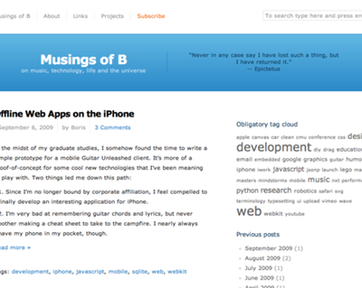
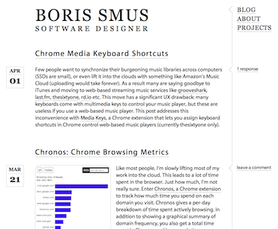
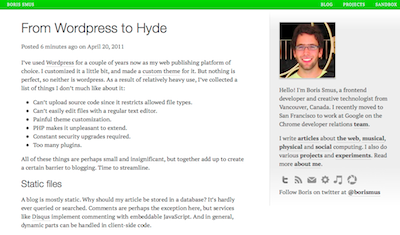
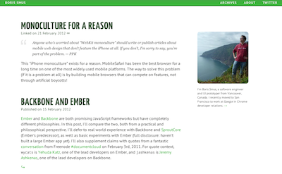

New design
==========
posted: 2012-03-30

I re-designed this site using the [PT Sans font][ptsans], aiming for
appealing typography for optimal readability. Interestingly,

> PT Sans is based on Russian sans serif types of the second part of the
> 20th century, but at the same time has distinctive features of
> contemporary humanistic designs.

Since visitors are increasingly coming from a variety of devices, I also
created three variants of the site for small, medium and large screens
via media queries:

<!--more-->

    @media screen and (max-width: $small) {/* small */}
    @media screen and (min-width: $small) and (max-width: $large) {/* medium */}
    @media screen and (min-width: $large) {/* large */}

Note that the above is valid [SCSS][scss] (as of version 3.2)! To try it out,
you may need to install the prerelease via `gem install sass --pre`.

As usual, the layout of this site is largely inspired by designers far
more skilled than I, including: <http://viljamis.com/> and
<http://www.markboulton.co.uk/>.

[ptsans]: http://www.google.com/webfonts/specimen/PT+Sans
[talks]: /archive/talks
[links]: /archive/links
[scss]: http://sass-lang.com/

## New engine

This blog can now also double as a micro blog, where I can easily [post
links][links] in a social network-agnostic way. Similarly, it now hosts
[all of my talks][talks], which used to live on
<http://smustalks.appspot.com>. It's also a lot easier for me to create
new posts.

All of these structural changes are largely due to me building a
completely new static site generator which addresses a lot of my pains
using other static generators. I'll write a separate article about this
engine when I'm ready to release it to the public.

## No more comments

Since the start of this blog, I've struggled with the concept of
comments on my site and in on blogs in general. Even with services like
disqus, which try to integrate your blog commentator personality into
one place, I feel that in practice, commenting on the web is very hard
to keep in one place, and the most interesting discussions end up
distributed in many pockets such as Hacker News, twitter, etc. Having
the in-blog comments as well only makes things messier.

Other problems include:

- Leaving a comment right after reading content encourages unconsidered
  responses, since readers haven't had time to process the content.
- Lately my blog has been generating a lot of spam comments that I need
  to moderate. I don't have time for that.
- People tend to ask for technical support in the comments, which adds
  very little value for other readers.
- Disqus slows down page load time, and presents a UI that's not easily
  skinnable.

For a more in-depth analysis about blog comments, see Matt Gemmell's
thorough post [on this subject][comments-off].

I've disabled comments on all posts. That said, I still want to hear
your ideas and feedback, and engage in discussion around topics I'm
obviously interested in (enough to write about!)

[comments-off]: http://mattgemmell.com/2011/11/29/comments-off/

## Evolving designs

This is the fourth iteration of my blog's design. I apparently do a
re-design every year, since I started in 2008.

This version was a small modification done to an existing wordpress
theme.

I really liked this version for a long time, since it was so clean and
minimal. Unfortunately the header took way too much space, and the
typography left something to be desired.

This was the first "responsive" version. It had too many gimmicky,
non-standard design elements.

I'm reasonably happy with the current version, especially the typography
in the main body.

And strangely excited about the engine that powers this blog too
(codenamed *Lightning*, which generates a lot of static, and is also
very fast! Ha, get it?). Once released, I will write another meta-blog
post about it. For now, though, I wrote a bit about Lightning
[here](/site).
