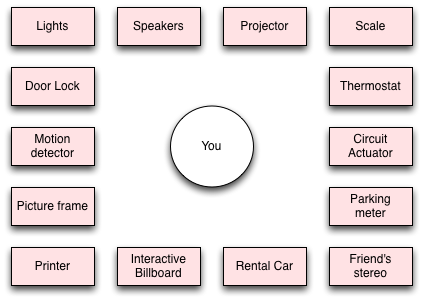
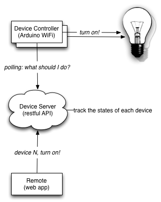
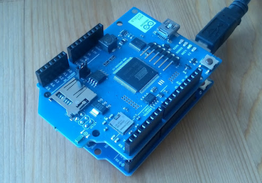

Internet mashup of things
=========================
posted: 2013-01-11

Many new devices come with unexpected connectivity - often a WiFi
connection that enables them to connect to a hotspot and the larger
internet. [Nest][nest], a smart thermostat, was one of the first
commercial products to do this. Many more indie projects are following
suit, with an explosion of kickstarters like this [teleoperated
light][lifx], [connected scale][withings] or this [general purpose
connected sensor][twine]. The idea of an Internet of Things, in which
every appliance and object is somehow connected, has long been popular
in academic circles, and this time around it feels like we're actually
close.

If we think of these physical devices/appliances as web services with
APIs, we can mash them up just like we did in the early days of the web,
creating applications that are more useful than the sum of their parts.
In this post I argue for using the web as the medium to tie everything
together, describe a simple architecture for building networked physical
devices and build a web lamp controlled by an arduino.

[nest]: http://www.nest.com/
[lifx]: http://www.kickstarter.com/projects/limemouse/lifx-the-light-bulb-reinvented
[twine]: http://supermechanical.com/twine/
[withings]: http://www.withings.com/

<!--more-->

## Web meets ubiquitous computing

The projects I mentioned above don't use proprietary home automation
protocols like X10.  Instead, they establish connections via the
internet. Nest registers itself with a central server (operated by Nest
inc) over WiFi. You can then control your thermostat by logging into
their website at nest.com.

There's no need for heavyweight ISO666 standardization efforts. This is
a very good thing, because it's really hard for anyone (including our
industry) to agree on something new. Instead, we reuse a proven protocol
that everyone's already agreed on: HTTP.

## An Internet of too many things

Nest also provides Android and iOS apps to control your thermostat. But
what happens when you have your thermostat, light bulbs, and home
theater, scanner and [printer][gcp] all connected up to the internet in
this fashion? Too many apps! Imagine you have all of these different
devices, perhaps multiple of each in some cases:

It pains me to imagine an app for each of these different services -
there are simply too many things to juggle. I would not want to install
apps for each of these devices for reasons similar to why I would never
install the United app: there is significant overhead to managing apps
on your smart phone. They take up space on your home screens, you need
to keep them up to date. [Scott Jenson][jenson] writes eloquently about
this problem on his blog.

If each hardware manufacturer releases their device with a central
registry and public API, however, third parties might be able to build
on top of the services that these devices provide, and certainly some
interesting and pleasant user experiences will arise in this nascent
area.

[jenson]: http://jenson.org/
[jenson-recent]: http://jenson.org/was-the-internet-just-an-accident/
[gcp]: http://www.google.com/cloudprint/learn/

## A minimum viable physical web architecture

There are many discovery protocols (eg. UPnP, zeroconf, ...), and many
messaging protocols (eg. TCP, HTTP, ...), and I won't argue for one over
another. The technical tradeoffs of each of these is outside of the
scope for this discussion. My approach was to devise the simplest
proof-of-concept that would work anywhere without fancy protocols, only
using widely available features available on the web, to enable a
platform for prototyping, the goal being to establish useful and
interesting interactions first, and implement the underlying technology
later.

In general, we want to be able to interact with devices that are nearby
and also with devices that are far away. With this constraint, even the
simplest approach requires a server component. Here's a sketch:

In this setup, the controller listens to the server for what it should
do. At the same time, the remote sends commands to the server based on
user interaction. The server keeps track of the state of all of the
devices it manages.

## Example: cloud lamp

The above approach is to simply have a RESTful server. The remote can
send commands to via POST requests, and the controller can poll for its
new state periodically with GET requests. A simple API for a lamp might
look like this:

- `GET /`: Returns 1 if the lamp is on. Otherwise returns 0.
- `POST /on`: Turns the lamp on.
- `POST /off`: Turns the lamp off.

This API and the three components (server, client and device) above are
enough to get a prototype off the ground. A simple implementation of all
three pieces can be found in the [Hello Lamp on github][hello-lamp].

The server-side is written on AppEngine, and simply tracks state. The
handlers all use [CORS][], which lifts the cross-domain security policy
of the web, making it possible to POST to the lamp from any web page. 

The client is a really simple web page with two ways of controlling the
lamp: the toggle switch and [speech recognition][webspeech] (available
behind a flag in Chrome), which enables simple "lamp, turn off" and "on"
commands.

Finally, the device itself is an Arduino Uno with a [WiFi
shield][shield]. One of the pins is connected to a relay which controls
a power socket with the plugged in lamp. The program itself is nearly
identical to the existing sample apps available for the WiFi shield.

[CORS]: http://en.wikipedia.org/wiki/Cross-origin_resource_sharing
[webspeech]: https://dvcs.w3.org/hg/speech-api/raw-file/tip/speechapi.html
[hello-lamp]: http://github.com/borismus/hello-lamp
[shield]: http://arduino.cc/blog/2012/08/16/the-arduino-wifi-shield-is-now-available/

## Practical considerations

The solution described here is definitely not one to use in production
for many reasons, including robustness, performance and security.

In practice, we'd probably want a server to control multiple devices, so
each request should specify an ID representing the device. Also,
continuous polling is a very inefficient approach, since every HTTP
request has a lot of overhead. It's better to maintain open connection
server-controller and server-remote connections to enable pushing of
data directly. This connection should be bidirectional to let the device
feed back to the remote as well as enabling control.

A promising startup working in the direction of making vision more real
is [electricimp](http://electricimp.com). These guys provide
connectivity through a SD card form factor they call an "imp". Though
they have a proprietary communication protocol between their imps and
their cloud (mainly for performance), they ultimately provide a RESTful
web API to control each imp. Definitely looking forward to playing with
their offerings.

## Mash it up

Now we have a device registering with a public web server. The server
provides an API for developers to access that device. Developers can
then build applications around that API which interact with the device.
This is no different from a regular web API, and at this point, all we
have built is a glorified remote control that uses the web instead of IR
for transmitting messages.

However! One of the great things about web APIs is that they can easily
be mixed with one another to create something greater than the sum of
the parts. This is known on the internet as a "mashup". The first
mashups emerged about decades years ago, but are still an important part
of the web landscape. I recently used a really nice one called
[lovely][], which is a house hunting mashup combining Google Maps and
craigslist. Mashup making services like [Yahoo! Pipes][pipes] and
[IFTTT][ifttt] have existed for a while. Notably, IFTTT includes support
for some of the "smart" physical devices I mentioned in the beginning of
this post.

To me, the truly interesting question around this physical web is the
user's experience. Each of the various promises of
device/appliance/thing control or automation is not terribly compelling.
Why would I unlock my phone, find and run the lamp app, and find the
right fixture? The alternative of walking up to the light switch and
flipping it seems much more lucrative. That said, I'm optimistic that
there are compelling user interfaces to be discovered, but they will
only emerge on top of this physical web framework.

[pipes]: http://pipes.yahoo.com/pipes/
[lovely]: http://livelovely.com/
[ifttt]: https://ifttt.com/

## A plea for physical APIs

As we move into a world connected devices, we need to have a solid,
widely available platform for communication between these devices. This
infrastructure can and should ultimately be the web.

This opinion of mine is not zealotry, but completely practical: I do not
want every device in my home to be stuck in an networked ecosystem
provided by some single company. Whether it's an Android app, an iOS
app, a web app, a universal dashboard on a smart phone, a voice
controlled system in the living room, or (more likely) something
completely different, any of these systems should be able to easily
interface with any device in the world.

The recent stink around [twitter no longer embedding instagram
photos][disconnected] is just one example of important chunks of the
internet become segregated from one another. This wall-building trend is
alarming and dangerous to the integrity of the web platform, which is
based on interoperability: cross-linking, cross-embedding, and API
mashups. While this new web of things is still in its infancy, it's
especially important that we nurture the same principles that made the
early web so great.

[disconnected]: http://www.technologyreview.com/view/508666/twitter-instagram-and-the-internet-of-disconnected-things/
