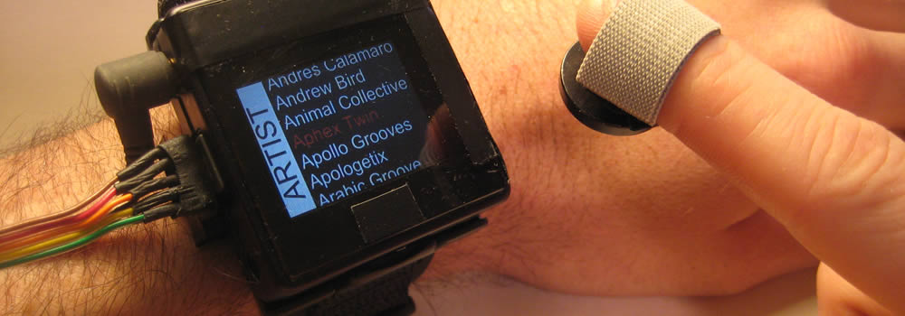
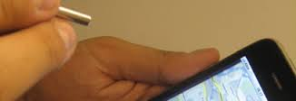
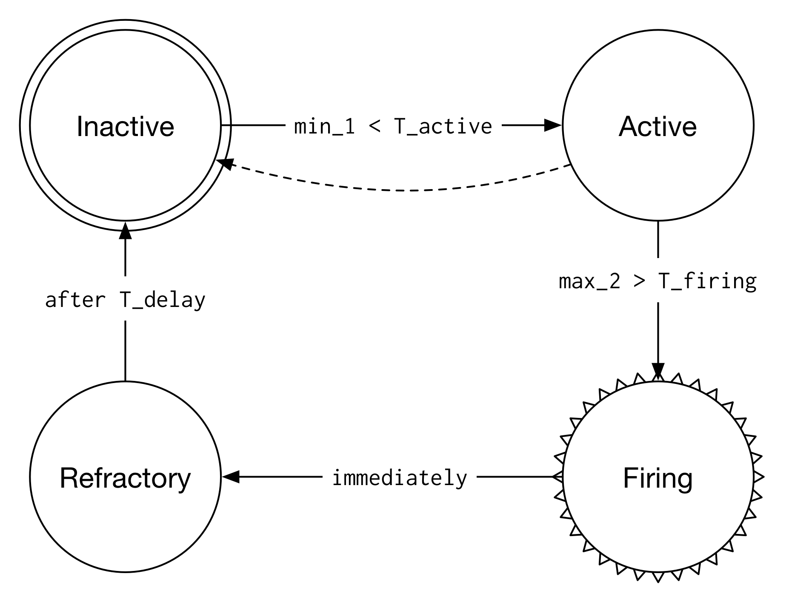

Magnetic Input for Mobile VR
============================
posted: 2015-09-07

It's easy to do, just follow these steps:

1. Cut two holes in a box
2. Put your phone in that box
3. Look inside the box

[And that's the way you do it][dickbox].

Your smartphone is now in a box, so how do you do input? Now that we have a
[paper][paper] accepted to [ISWC 2015][iswc], I can tell you!

<!--more-->

[dickbox]: https://www.youtube.com/watch?v=ABrSYqiqvzc&t=1m42s
[iswc]: http://iswc.net/

## It's not easy being in a box

Let me remind you: your smartphone is still in a box. This means that your
fingers can't reach the touch screen or the volume buttons. Let's consider a
couple of input alternatives:

- Cameras and microphones require extra app permissions, are inefficient to keep
    always on, and may face many false positives.
- External electronic devices cost money. Plugging them in and out is a
    usability nightmare.

Ok, let's nix those. How about permanent magnets? They are inexpensive, robust,
require no power to operate, and do not degrade over time. The vast majority of
smartphones have a magnetometer, which is used for the compass. Intriguing...

## Fun with permanent magnets

In 2009, Chris Harrison and Scott Hudson published [Abracadabra][abra], a
magnetic ring form factor for finger interactions with small devices:

In 2010, Hamed Ketabdar and others published [Magitact][magitact], instead using
a magnetic rod for more varied interactions near smartphones:

In 2011, Daniel Ashbrook and others published [Nenya][nenya], which is similar
to Abracadabra, but focused more on the eyes-free input aspects:

In 2013, Sungjae Hwang and others published [Maggetz][maggetz], which used
passive magnets to build all sorts of widgets around the device:

[abra]: http://www.chrisharrison.net/index.php/Research/Abracadabra
[magitact]: https://www.facebook.com/MagiTact
[nenya]: http://dl.acm.org/citation.cfm?id=1979238
[maggetz]: https://www.youtube.com/watch?v=_sSgp0hD-jk

## Fucking magnets: how do they work?

Magnets affect the magnetometer in an [inverse-cubic relationship][cubic], so
distance between magnet and magnetometer really makes a dramatic difference in
signal strength. We empirically determined that in most phones, the sensor is
placed at the top of the device, near the earpiece:

<table>
<tr><th>Smartphone Model</th><th>Sensor Location</th></tr>
<tr><td>Moto X</td><td>Top</td></tr>
<tr><td>Nexus 4</td><td>Top</td></tr>
<tr><td>Nexus 5</td><td>Top</td></tr>
<tr><td>Samsung S4</td><td>Top</td></tr>
<tr><td>Galaxy Nexus</td><td>Top</td></tr>
<tr><td>Samsung S3</td><td>Bottom</td></tr>
<tr><td>Moto G</td><td>Bottom</td></tr>
</table>

Some magnetometers are really screwy, like the one found in the first revision
of the HTC M7, or broken, like in some models of the Galaxy Nexus we tested
with. There's little that we can do in these cases, but luckily they are quite
rare.

The way you access the magnetometer on Android is via the sensor stack,
requesting the `TYPE_MAGNETIC_FIELD` sensor. This is a calibrated sensor, since
it's primarily used to determine the direction of magnetic north for the
compass. Calibration means that somewhere deep inside Android, software and
hardware periodically calibrates the output of the sensor. When calibration
occurs, magnetometer readings effectively reset to some new coordinate system.

Calibration can happen at any point, and the calibration pattern can look quite
different depending on the device. In some cases, it's a gradual calibration,
not a sudden spike as above. This limitation restricts what we can reliably
detect, which is why we chose a pull-and-release interaction. Android already
has provisions for an uncalibrated magnetometer via
`TYPE_MAGNETIC_FIELD_UNCALIBRATED`, but this sensor is not nearly as ubiquitous
as its calibrated cousin. Even so, we should be robust to phone insertions and
removals from Cardboard, which can also look like calibration events.

[cubic]: https://www.quora.com/Why-does-the-magnetic-field-obey-an-inverse-cube-law

## Magnetic input for VR

<iframe width="853" height="480" src="//www.youtube.com/embed/a53a-9FLdL8" frameborder="0" allowfullscreen></iframe>

As you can see, the interaction involves pulling the magnet downward, and
releasing it. The magnetic ring automatically returns to its rest position
because of the force exerted on it by an internal magnet. The external magnet is
also held in-place by the same force, and while it's possible to pull the magnet
off the cardboard side, it takes concerted effort to do so. The motion of the
magnet is constrained by a cardboard indentation, so it can only move downward.
The thing I find most elegant about this design is that both the digital signal
to the smartphone and the physical mechanism itself relies on the same
principle: magnetism.

We collected a bunch of data for this pull-and-release interaction from many
devices. We found that most devices behave predictably well. Here's a combined
plot of normalized, superimposed positives and negatives from all phones which
we collected data from, with each dimension of the magnetometer vector plotted
separately.

The detector we built was not based on a template learned from all of the data
above, but a simpler state machine based on thresholding. The thresholds
themselves were learned empirically. Here's the simple state machine:

The basic idea is that we take a sliding window approach, normalizing all of the
data relative to the last value in the window. For each window, we calculate `min_1`,
which is the smallest value of the first half of the window, and `max_2`, the
largest value in the second half. Next, we compare to empirically determined
thresholds perform the appropriate transition in the state machine. I won't bore
you with details of normalizing the data, etc but you can find all of the
details in [the paper][paper]. Oh, and all of the code is also available [on
github][github].

[github]: https://github.com/dodger487/MIST

## What's next?

A lot more can be done using passive magnetic input. With uncalibrated
magnetometers, there is no fear of calibration events, so we could implement a
faster detector based on just the down motion of the magnet. We could reliably
detect long presses and double clicks. Alternatively, extensions to the existing
input can be implemented by simply changing the geometry of the physical
constraints, such as a joystick form factor.

I'm incredibly happy that Cardboard has been doing so well. Thanks to the great
team working so hard on it, there are now [over 1 million units shipped][1m].
The press has been happy with it too, with kind reviews from many tech
publications.

[Techcrunch][tc] said:

> This funny little cardboard faux-Rift has something even the original Rift
> itself does not: a built-in button. Your phone is able to sense the magnet’s
> movement, allowing it to act as a ridiculously clever little button. Yeesh.

[Techradar][tr] said:

> What's also somewhat amazing is the magnet on the side. […] The little magnet
> on the side is actually a quite ingenious design aspect of Google Cardboard.
> It's a button!

[Engadget][eng] said:

> One of the things I liked most was a switch located on the left temple, which
> consists of just a couple of magnets and a metal ring.

[Future versions of Cardboard][v2] are switching to a different input method
using a conductive button which brings your body's capacitance to the screen,
similar to how a touch stylus works. It's cheaper without them, and the new
input works well, but I'll definitely miss the magnets!

[paper]: mimvr-iswc-2015.pdf
[1m]: http://techcrunch.com/2015/05/28/google-has-shipped-over-1-million-cardboard-vr-units/
[v2]: http://www.google.com/get/cardboard/downloads/wwgc_manufacturers_kit_v2.0.zip
[tc]: http://techcrunch.com/2014/06/25/hands-on-with-googles-incredibly-clever-cardboard-virtual-reality-headset/
[tr]: http://www.techradar.com/news/phone-and-communications/mobile-phones/google-cardboard-everything-you-need-to-know-1277738
[eng]: http://www.engadget.com/2014/12/10/google-cardboard/
