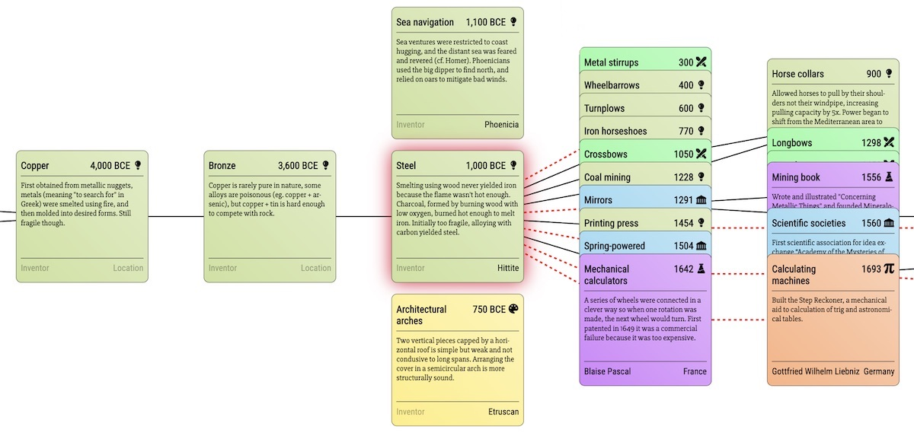
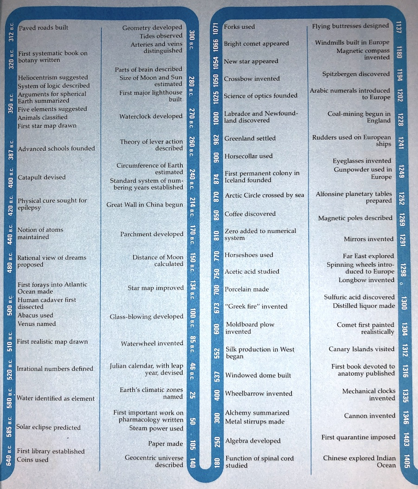
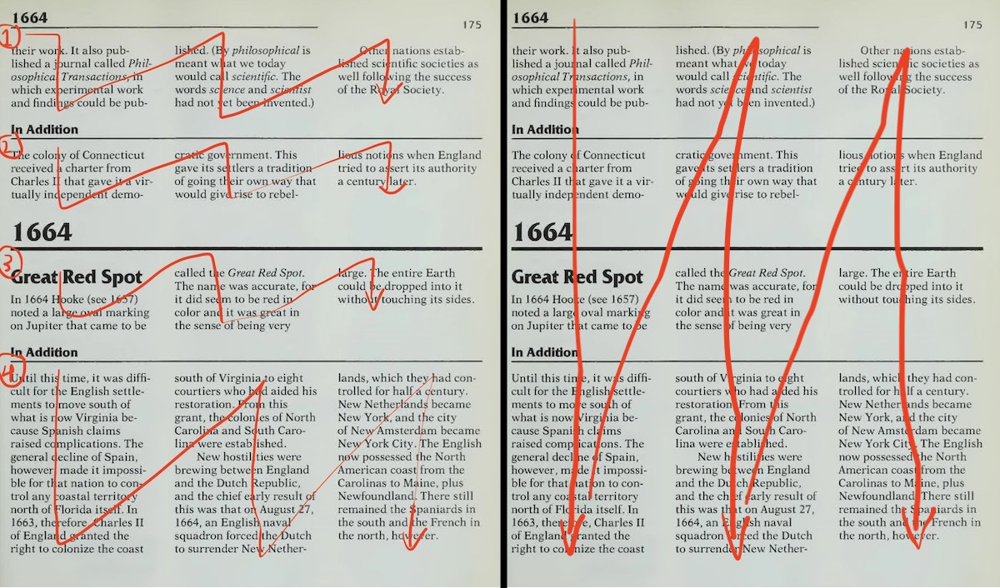

Visual Chronology of Science & Discovery
===
posted: February 10, 2020

As Newton wrote, “If I have seen further it is by standing on the shoulders of Giants”. But which Giant’s shoulders did Newton stand on? Did those Giants also stand on the shoulders of other Giants? What about other scientists and inventors? As far as I can tell, it’s giant turtles all the way down.

Last year, I got my hands on a remarkable book, [Asimov’s Chronology of Science and Discovery](/books/asimovs-chronology-of-science-and-discovery/). It inspired me to produce a visual summary of the first ⅕ of the book. It looks something like this:

<!--more-->

One of the unnerving things about the collection was the visual summary in the first edition:

Following this winding path is tricky to say the least. With this in mind, I carefully read the first quarter of the book, spanning from the beginning of time until 1700 CE, which amounts to about 300, or about a fifth of all of the entries in the book. I took notes in a spreadsheet, providing a 1-2 sentence summary of each entry and manually extracting some key metadata. For each of Asimov’s entries, I captured the title, a couple sentences of description, the associated person’s name, and where the invention was created or discovery found, usually the country or empire.

In addition, I provided two extra fields which are more subjective and frankly, made up by yours truly, to bring the visualization to life: 

1. **Field**: which domain was this discovery made. (How granular should this be? Should Science be split up into Chemistry, Physics, and Biology?)
2. **Dependencies**: what older inventions and discoveries enabled this one. (This can be really tricky.)

With this in place, Asimov’s linear chronology becomes directed graph, and since we don’t know how to time travel, there are no time cycles. So what we have is a directed acyclic graph (DAG). It is not a tree since I allow each node to have multiple parents. For instance, **Geometry** is rooted in **Advanced Schools**, since Elements was a compilation of proofs developed by others at the Academy, as well as **Logic**, since the whole field of geometry is built up sequentially from axioms.

## Manual entry is tiring

Sadly, the Chronology is not available as a text-based ebook, which complicates matters. As it turns out, OCR is not easy, especially if your content is laid out like a newspaper:

Google Cloud Vision and tesseract don’t do well on complex text flows, often failing to recognize section boundaries. For the image above, tesseract wrongly assumes that that the text flows in three full height columns.

I also tried to do automatic entity extraction using python’s `nltk` and `ne_chunk` to automatically generate inventors and locations but a quick experiment yielded too many entities for each entry, meaning that I’d have to make a manual pass regardless, and this step would provide minimal time savings.

## Playing cards and tech trees

Each invention and discovery needs its own view. I gravitated to a card metaphor, which is often used in historical strategy games like Civ, and in many playing card games like Magic the Gathering. Here are a [few examples](https://www.are.na/boris-smus/tech-tree-cards) that inspired me.

One challenge that I found ultimately insurmountable was to find good images for each entry. While you can find reams of royalty free images, and even download them automatically using tools like [googleimagesdownload](https://github.com/hardikvasa/google-images-download), finding a set that is visually consistent is a real challenge. I found images for the first hundred inventions. Theoretically a style transfer model might be able to convert them all to a consistent look. But ultimately, they didn’t add much value to the visualization as a whole, so I ditched the idea.

## Chronological visualization

To visualize, I started with a naive approach: render all of the entries at once in a giant horizontal scrolling view, kind of like how tech trees work in Civilization-like games. Doing such a thing linearly makes no sense at all, since the first entry in the book is Bipedalism at 4 ma, followed by Stone Tools at 2 ma, and . This sort of timeline is best represented on a log-scale, which makes entries more reasonably spaced out, although still not perfect. Actually there’s quite a lot of variation in density. For example, this is the chronology of the first millennium CE:

While this is just the 16th century (10 times shorter than above):

Even with the log-scale, inventions are by no means well distributed in time, with the 16th century far more visually dense than the first millennium. In both examples, links are especially obscure, since they often stretch out for many screens, and are basically impossible to trace from source to destination. 

I tried variants of this view as well, involving collapsing entries into more compact default representations, and allowing them to be expanded for more detail. One promising variant involved expanding a selected entry and all transitively linked ones, but the predecessors and successors are still typically positioned far off-screen, so a lot of scrolling is required.

## Entry-centric visualization

One of the shortcomings of a purely chronological view is that connections between entries are lost. Yet this is the most important part of this whole project, so I kept searching.

I opted for a more structured approach, one that lets you focus on a particular entry and at a glance see what technology led to it, and what technology it enabled. At the same time, I wanted to show the invention in its chronological context, in the spirit of Asimov’s book. So the current design takes a Cartesian approach, with one card at the origin serving as the focus. Technologies that enabled the focused card are shown to the left and technologies that the focus enabled are shown to the right, along the x axis. Chronologically previous and next entries are shown along the y axis. 

## Technology transcending fields

Once the dependency graph is in place and each entry is associated with a field, one starts seeing interesting patterns in the data. 

The discovery of magnetism lead to the invention of the compass, giving navigators confidence to traverse the ocean, in turn leading to the discovery of the new world:

Melting glass beads and glass blowing enabled lens crafting and microscopes which in turn let careful observers see microorganisms in pond water, ultimately leading to great advances in medicine. Such patterns involve cross field dependencies, which are visualized as dashed red arrows:

