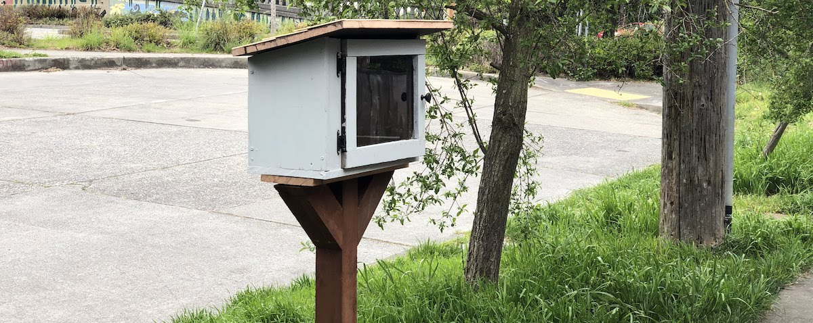

DIY Community Library
===
posted: April 25, 2020

When my sailing class was canceled back in early March, I realized it was time for a more individualistic hobby. And so, I furled the sails and tied up the boat and picked up a circular saw from the hardware store. After I got over my fears of loud, terrifyingly quickly spinning metal blades, a whole bunch of cutting and screwing, then digging and painting, I have a Little Free Library standing outside my house, and a little bit more confidence for the next woodworking project!

Here are some [more photos](https://photos.app.goo.gl/K3xP2XjPmUQ2bX1N7) that document the making of process.

<!--more-->

I drafted some [initial plans in OnShape](https://cad.onshape.com/documents/d57c2f5444558be437e513c4/w/9e862248a8541fe7ce7a38a6/e/3efc51d554390f104d869fa6), and deviated from them only slightly, the main difference being a much smaller front-right panel to make book access easier. As I became familiar with woodworking tools, I became a little bit less rigid and precise with measurements. 

## Materials

- A very long plank of scrap wood found in my basement, 20mm deep was enough for structural materials.
- 30 or so brass screws
- 6 long screws
- A fence post
- Self-closing hinges and a button
- Exterior-grade paint
- A sheet of thin scrap plywood for shingles
- Plexiglass sheet
- Circular saw
- Electric drill
- Silicone mat
- Caulk
- Hammer
- Shovel
- Wood hand saw
- Probably lots more

## Mistakes and learnings:

- Don’t use brass screws, they are fragile. I broke two of them as I was screwing them. Instead, use steel. It’s cheaper and far stronger.
- Don’t rely on glue for shingles. They warp, so use nails to hammer them on. I had to do this after it rained and they warped, despite a copious amount of glue.
- Don’t rely on the guide of the circular saw. Instead, look at what the blade is actually doing at the cut point. I had a few rough cuts early on.
- Use a protractor in order to measure 45 degree angles more accurately, which I found tricky to do through thick 4x4 fence posts (circular saw radius was too small, had to use a hand saw)

The results are passable but honestly, a little bit sloppy. Build quality aside, I’m thrilled to see actual use: the roster of books changing quickly. My initial dump of philosophy books was partially picked off, and then swiftly amended. I had predicted very little movement during the pandemic because of decreased foot traffic and increased paranoia about touching public things, but was sorely mistaken.

Many thanks to Matthew for the pro-tips and help!

