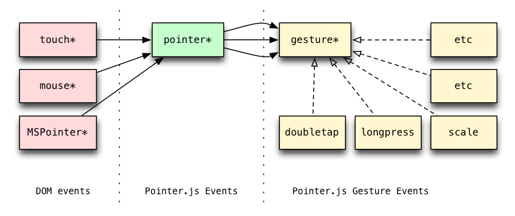

Generalized input on the cross-device web
=========================================
posted: 2012-06-14

**Update (August 7, 2013): Pointer.js is deprecated. Please use the
[PointerEvents polyfill][pe] instead.**

Mouse will soon cease to be the dominant input method for computing,
though it will likely remain in some form for the forseeable future.
Touch is the heir to the input throne, and the web needs to be ready.
Unfortunately, the current state of input on the web is... you guessed
it: a complete mess! There are two separate issues:

1. No unified story between mouse, touch, and other spatial input.
2. Poor support for complex gestures, especially needed for touch.

I'll look at each in a bit of detail, and then show you
[pointer.js][pointerjs]. 

[pe]: https://github.com/Polymer/PointerEvents

<!--more-->

## Lack of unified touch and mouse system

Most web developers should care about providing a good experience on
both mouse and touch interfaces. This is increasingly true with
crossover mouse-touch devices like the Transformer prime, and upcoming
Windows 8 laptops.

Here's what you end up with if you want to support touch and mouse
events on the web today:

    $(window).mousedown(function(e) { down(e.pageY); });
    $(window).mousemove(function(e) { move(e.pageY); });
    $(window).mouseup(function() { up(); });

    // Setup touch event handlers.
    $(window).bind('touchstart', function(e) {
      e.preventDefault();
      down(e.originalEvent.touches[0].pageY);
    });
    $(window).bind('touchmove', function(e) {
      e.preventDefault();
      move(e.originalEvent.touches[0].pageY);
    });
    $(window).bind('touchend', function(e) {
      e.preventDefault();
      up();
    });

The above is a bunch of boilerplate code that does absolutely nothing!
You end up having to manually wrangle two completely different models
into one.

Microsoft is taking a very smart approach with IE10 to address this
issue by [introducing pointer events][ms-pointer-events]. The idea is to
consolidate all input that deals with one or more points on the screen
into a single unified model.

Unfortunately, it's not being proposed as a standardized spec.
Also, because it's not universally available, it will be yet another
thing developers need to support (if they want to support Windows
8/Metro apps). So now our sample above gets [even more
boilerplate][mess], with at least three more calls like the following:

    $(window).bind('MSPointerDown', function(e) {
      // Extract x, y, and call shared handler.
    });
    $(window).bind('MSPointerMove', function(e) {
      // Extract x, y, and call shared handler.
    });
    $(window).bind('MSPointerUp', function(e) {
      // Extract x, y, and call shared handler.
    });

Although their intentions are good, this approach potentially makes the
situation (hopefully temporarily) worse.

[mess]: http://blogs.msdn.com/b/ie/archive/2011/10/19/handling-multi-touch-and-mouse-input-in-all-browsers.aspx

## Touch gestures need to be easy

Touch UIs often involve gestures that aren't easy for developers to
implement, such as pinch-zooming and rotation. However, on the web, due
to the simplicity of [the touch events][touch-spec], even implementing
something as simple as a button [is non-trivial][fast-button].
Implementing more complex gesture recognizers on top of the primitive
`touch*` events is even less trivial.

Frameworks like [Sencha Touch][sencha] and [Hammer.js][hammer] come to
the rescue to address the lack of gestures, however these both have
problems. Sencha comes as a complete package, and it's impossible to use
their gesture recognizer without using their whole framework (or
spending considerable effort trying to pull it out). Hammer.js, on the
other hand, doesn't actually implement gesture recognition for
pinchzoom, but instead relies on the touch spec providing non-standard
`rotation` and `scale` values [pioneered by Apple][apple-touch].

Microsoft has a gesture layer on top of their consolidated pointer
model. This makes sense as an approach to take. True, certain gestures
only make sense for touch, and it's easy to distinguish the input type
using the `event.pointerType` API. That said, with a unified model,
there can be new gestures that span multiple input modalities, like
[this research][uist] suggests.

[ms-pointer-events]: http://blogs.msdn.com/b/ie/archive/2011/09/20/touch-input-for-ie10-and-metro-style-apps.aspx
[touch-spec]: https://dvcs.w3.org/hg/webevents/raw-file/tip/touchevents.html
[fast-button]: http://code.google.com/mobile/articles/fast_buttons.html
[apple-touch]: http://developer.apple.com/library/safari/#documentation/UserExperience/Reference/TouchEventClassReference/TouchEvent/TouchEvent.html#//apple_ref/doc/uid/TP40009358
[sencha]: http://dev.sencha.com/deploy/touch/examples/production/kitchensink/index.html#demo/touchevents
[hammer]: http://eightmedia.github.com/hammer.js/
[uist]: #

## Pointer.js - A solution to both problems

The solution to this problem is to write another library, tag on a `.js`
to the end of the name, get everyone to use it, prove that it's very
useful, and have browsers and spec implement it natively. Once this
is spec'ed, approved, and widely implemented, it should just be a matter
of removing the script tag!

Pointer.js consolidates pointer-like input models across browsers and
devices. It provides the following:

- Events: `pointerdown, pointermove, pointerup`
- Event payload class: `originalEvent, pointerType, getPointerList()`
- Pointer class: `x, y, type`

To use it, simply include `pointer.js` in your web page. This
automatically rigs `addEventListener` with support for `pointer*` and
`gesture*` events.

Try some simple pointer.js demos:

- [Multi-touch drawing][demo-draw]
- [Pointer event logger][demo-pointer]
- [Gesture event logger][demo-gesture] (supports scale, longpress and doubletap)

For more info about the library, check it out at
<https://github.com/borismus/pointer.js>. Contributions in the form of
pull requests are most welcome: more demos using pointer events,
unimplemented gesture recognizers for common gestures, like swipe and
rotation, and tweaks to the system itself.

[demo-draw]: http://borismus.github.com/pointer.js/demos/draw.html
[demo-pointer]: http://borismus.github.com/pointer.js/demos/basic-pointers.html
[demo-gesture]: http://borismus.github.com/pointer.js/demos/basic-gestures.html
[pointerjs]: https://github.com/borismus/pointer.js
