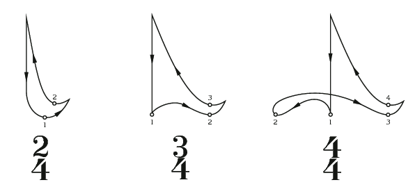
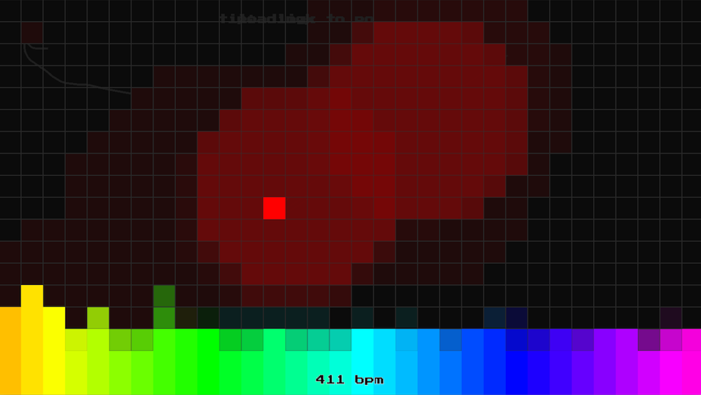
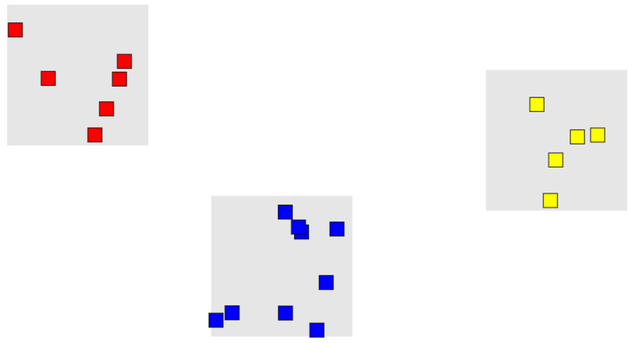

Gestural music direction
========================
posted: 2013-05-03

Imagine this: you start conducting as if you were in front of a great
orchestra, and music fades in out of thin air, matching your tempo and time
signature. Your nuanced gestures can indicate changes in intensity, and of
course affect the speed of the piece. You'd first need to learn some
basic conducting patterns, like these:

<!--more-->

You would also have to wait for me to finish this project, which uses a LEAP
motion device (or your trackpad), the Web Audio API, and some signal processing
to achieve a scaled back version of the idea described above.

## Prototype

The current prototype lets you control the tempo of a song called "Phantom"
from the excellent [Parov Stelar][parov]. You can do this by making simple
conducting patterns, similar to the 2/4 pattern above. In practice, you can use
any pattern in which your hand oscillates between two points in space to play
with this prototype. You can even use your mouse instead of a LEAP motion
device. Just click in to enable pointer lock. This will ensure that your mouse
will always be focused inside your browser.

I built a visualizer which is an 8-bit inspired frequency graph which
also shows directional changes as pulsating red dots, and clusters which
flash to the beat.

[][demo]

If you'd like to try it live, the [demo lives here][demo].

[parov]: http://www.parovstelar.com/
[demo]: http://borismus.github.io/gestural-music-direction/

## Handling input

With a LEAP device plugged in, the prototype maps the palm's 3D center
to 2D. It works just as well with just a trackpad or mouse attached to
your computer, which directly outputs 2D coordinates. The input handling
algorithm then uses the resulting (x, y) pairs to do roughly the
following:

- First, track positions and first (velocity) and second (acceleration)
  order history, including times. Store in a ring buffer, which is
  implemented in [ring-buffer.js][ring-buffer.js].

- Extract sudden changes of direction based on heuristics related to
  velocity and acceleration history.

- Cluster directional changes using K-means or similar clustering
  algorithm which is implemented in [clusterizer.js][]. I run this
  K-means implementation with 3 values of k in [2, 3, 4] and pick the
  one with the lowest error. I've also build a standalone
  [clustering test page][cluster-page] with the following output:

- To calculate tempo, pick a cluster and calculate mode of the deltas
  between adjacent points.

- The time signature is just the number of clusters over 4 (for the
  simple 2/4, 3/4 and 4/4 patterns).

[ring-buffer.js]: https://github.com/borismus/gestural-music-direction/blob/master/js/ring-buffer.js
[clusterizer.js]: https://github.com/borismus/gestural-music-direction/blob/master/js/clusterizer.js
[cluster-page]: http://borismus.github.io/gestural-music-direction/cluster.html

## Changing tempo in real-time

Once we have an idea of what pattern the user is creating with their hands, we
need to match up the song to the pattern, and continuously adapt the song's
playback rate to the user's motions.

The Web Audio API makes it dead simple to change the playback rate of an audio
buffer for a source node'ss entire duration. However, things get a bit
trickier if this rate changes continuously over time. Chris Wilson
describes a scheduling technique which addresses this exact problem in
his ["Tale of Two Clocks" HTML5Rocks article][cwilso]. You can also see
a simple version of it inaction in his [metronome demo][metronome].

I used this idea to do a bit of granular synthesis on an audio buffer. I
schedule a bit of the buffer into the future, at the current tempo. As the
tempo changes, new bits of the buffer are scheduled at a different
playbackRate. I keep track of how far into the buffer we've gone and use that
as the grainOffset. Here's some code that illustrates this (but see the
[variable rate music player][music-player.js] for the full code):

    MusicPlayer.prototype.loop_ = function() {
      // Schedule the next bar if it's not yet scheduled.
      while (this.nextNoteTime < audioContext.currentTime + this.scheduleAheadTime) {
        this.scheduleSegment_(this.grainOffset, this.nextNoteTime);
        this.nextNote_();
      }
    }

    MusicPlayer.prototype.scheduleSegment_ = function(grainOffset, time) {
      // Get the part of the buffer that we're going to play.
      var source = audioContext.createBufferSource();
      source.buffer = this.buffer;
      source.connect(audioContext.destination);

      var rate = this.getPlaybackRate_();
      source.playbackRate.value = rate;

      var secondsPerBeat = 60.0 / this.tempo;
      source.noteGrainOn(time, grainOffset, secondsPerBeat * rate);
    }

    MusicPlayer.prototype.nextNote_ = function() {
      // Advance current note and time by a 16th note...
      var secondsPerBeat = 60.0 / this.tempo;
      // Notice this picks up the CURRENT tempo value to calculate beat length.
      this.nextNoteTime += secondsPerBeat;
      // Get the next grain.
      var rate = this.getPlaybackRate_();
      this.grainOffset += secondsPerBeat * rate;
    }

In practice, I'm unfortunately hitting some rounding errors, so the
grains aren't stitched together as seamlessly as I wanted. You can
sometimes hear artifacts if you slow the tempo way down.

[cwilso]: http://www.html5rocks.com/en/tutorials/audio/scheduling/
[metronome]: http://www.html5rocks.com/en/tutorials/audio/scheduling/goodmetronome.html
[music-player.js]: https://github.com/borismus/gestural-music-direction/blob/master/js/music-player.js

## A work in progress

My initial idea was to use [The Echo Nest][echonest] to pick the right song
(based on time signature and tempo), and then stream that song from some
streaming music service. Unfortunately it's quite hard to get at PCM versions
of tracks from Rdio and Spotify. That said, it can be [done with
Soundcloud][ambientcloud]. Long story short, the prototype currently only
supports one song.

A time signature recognizer is mainly useful for classical music, since so much
of popular music is in common time (with [rare exceptions of popular music with
complex time signatures][complex-pop]). But applying simple transformations
like changing the tempo just feels wrong for complex music without a very
obvious rhythmic structure.

Lastly, LEAP's palm tracking is still quite noisy (even after drastic
improvements to palm tracking as of [SDK 0.7.7][leap-change-list]). Also, the
bay windows in my living room lets in tons of infrared light which often puts
the device into a low fidelity tracking mode.

As always, let me know what you think, and of course, feel free to fork
and evolve on [github][].

[echonest]: http://developer.echonest.com/
[leap-change-list]: https://developer.leapmotion.com/blog/sdk-0-7-7-released-new-palm-tracking-and-gesture-settings
[ambientcloud]: https://github.com/oampo/AmbientCloud
[complex-pop]: http://twentytwowords.com/2011/05/18/6-pop-songs-in-unusual-time-signatures/
[github]: https://github.com/borismus/gestural-music-direction
