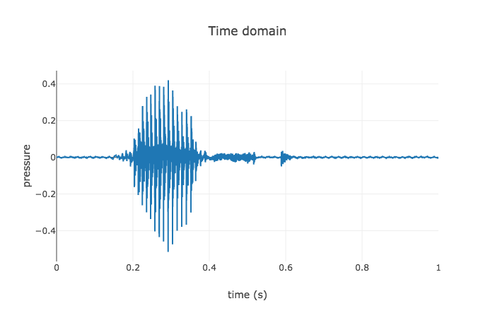
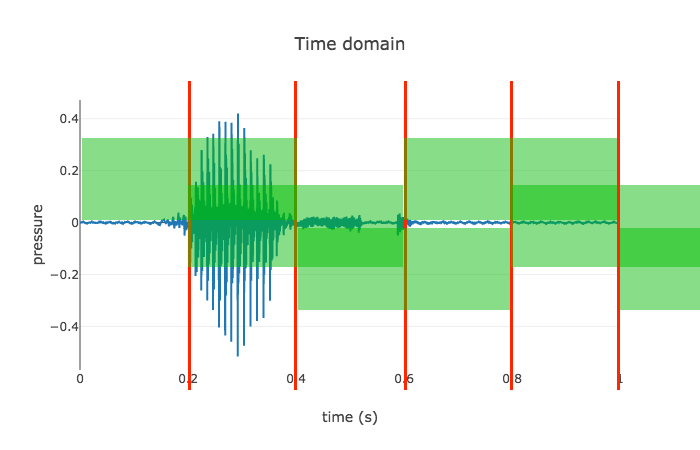
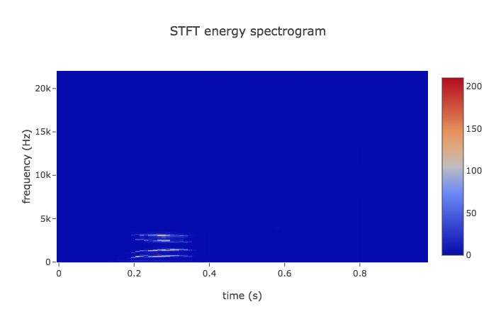
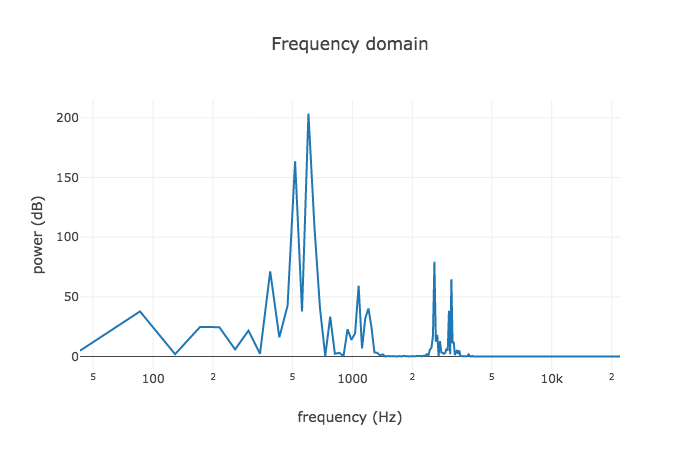
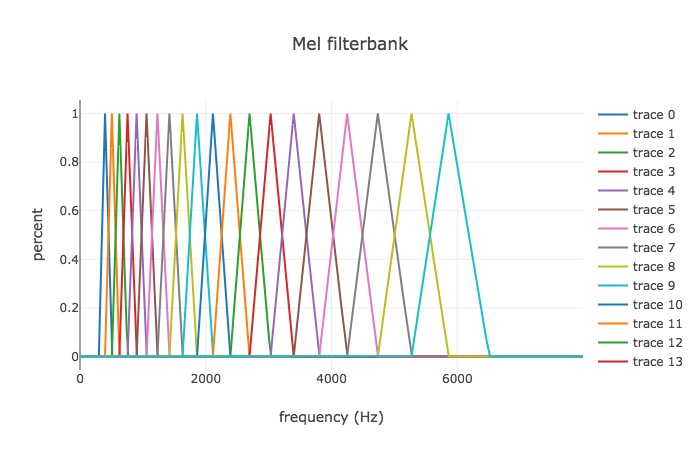
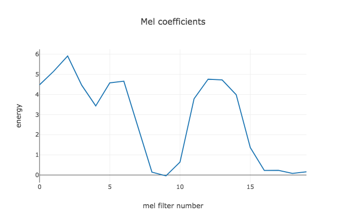
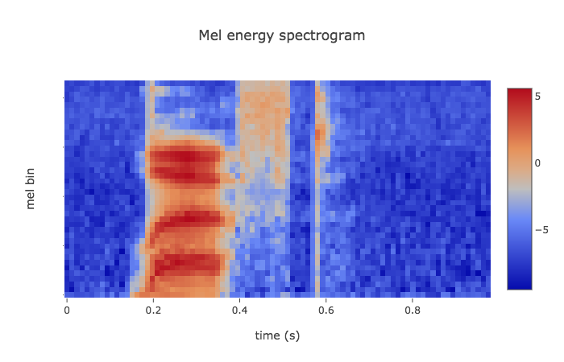

Audio features for web-based ML
===
posted: December 15, 2017

One of the first problems presented to students of deep learning is to classify
handwritten digits in the [MNIST dataset][mnist]. This was recently [ported to
the web][mnist-web] thanks to [deeplearn.js][deeplearn]. The web version has
distinct educational advantages over the relatively dry TensorFlow tutorial.
You can immediately get a feeling for the model, and start building intuition
for what works and what doesn't. Let's preserve this interactivity, but change
domains to audio. This post sets the scene for the auditory equivalent of MNIST.
Rather than recognize handwritten digits, we will focus on recognizing spoken
commands. We'll do this by converting sounds like this:

<audio src="left.wav" controls></audio>

Into images like this, called log-mel spectrograms, and in the [next post][next],
feed these images into the same types of models that do handwriting recognition
so well:

The audio feature extraction technique I discuss here is generic enough to work
for all sorts of audio, not just human speech. The rest of the post explains
how. If you don't care and just want to [see the code][code], or [play with some
live demos][demo], be my guest!

[mnist]: https://www.tensorflow.org/get_started/mnist/beginners
[mnist-web]: https://deeplearnjs.org/demos/model-builder/
[deeplearn]: https://deeplearnjs.org

<!--more-->

# Why?

Neural networks are having quite a resurgence, and for good reason. Computers
are beating humans at many challenging tasks, from identifying faces and images,
to playing Go. The basic principles of neural nets is relatively simple, but the
details can get quite complex. Luckily non-AI experts can get a feeling for what
can be done because a lot of [output][eg1] is [quite][eg2] [engaging][eg3].
Unfortunately these demos are mostly visual in nature, either examples of
computer vision, or generate images or video as their main output. And
few of these examples are interactive.

[eg1]: http://www.cs.ubc.ca/~van/papers/2017-TOG-deepLoco/
[eg2]: https://www.youtube.com/watch?v=5h4R959O0cY
[eg3]: http://prostheticknowledge.tumblr.com/

# Pre-processing audio sounds hard, do we have to?

Raw audio is a pressure wave sampled at tens of thousands times per second and
stored as an array of numbers. It's quite a bit of data, but there are neural
networks that can ingest it directly.  Wavenet does [speech to
text][wavenet-stt] and [text to speech][wavenet-tts] using raw audio sequences,
without any explicit feature extraction. Unfortunately it's slow: running speech
recognition on a 2s example took 30s on my laptop. Doing this in real-time, in
a web browser isn't quite ready yet.

Convolutional Neural Networks (CNNs) are a big reason why there has been so much
interesting work done in computer vision recently. These networks are designed
to work on matrices representing 2D images, so a natural idea is to take our raw
audio and generate an image from it. Generating these images from audio is
sometimes called a frontend in [speech recognition papers][fe-example]. Just to
hammer the point home, here's a diagram explaining why we need to do this step:

The standard way of generating images from audio is by looking at the audio
chunk-by-chunk, and analyzing it in the frequency domain, and then applying
various techniques to massage that data into a form that is well suited to
machine learning. This is a common technique in sound and speech processing, and
there are great implementations in [Python][librosa]. TensorFlow even has a
[custom op][tf-audio] for extracting spectrograms from audio.

On the web, these tools are lacking. The Web Audio API can almost do
this, using the `AnalyserNode`, as I've shown [in the past][spectrogram], but
there is an important limitation in the context of data processing:
`AnalyserNode` (nee `RealtimeAnalyser`) is [only for real-time][wa-so] analysis.
You can setup an `OfflineAudioContext` and run your audio through the analyser,
but you will get unreliable results. 

The alternative is to do this without the Web Audio API, and there are
[many][dsp3] [signal processing][dsp1] [JavaScript libraries][dsp2] that might
help. None of them are quite adequate, for reasons of incompleteness or
abandonment. But here's an illustrated take on extracting Mel features from raw
audio.

[fe-example]: https://static.googleusercontent.com/media/research.google.com/en//pubs/archive/43960.pdf
[wavenet-stt]: https://github.com/buriburisuri/speech-to-text-wavenet
[wavenet-tts]: https://deepmind.com/blog/wavenet-generative-model-raw-audio/
[spectrogram]: https://borismus.github.io/spectrogram/
[wa-so]: https://stackoverflow.com/questions/45697898/web-audio-api-getfloatfrequencydata-function-setting-float32array-argument-data
[dsp1]: https://github.com/oramics/dsp-kit
[dsp2]: https://github.com/corbanbrook/dsp.js/
[dsp3]: https://github.com/vail-systems/node-mfcc
[librosa]: https://github.com/librosa/librosa
[tf-audio]: https://github.com/tensorflow/tensorflow/blob/master/tensorflow/examples/wav_to_spectrogram/wav_to_spectrogram.cc

# Audio feature extraction

I found an [audio feature extraction tutorial][tut], which I followed closely
when implementing this feature extractor in TypeScript. What follows can be a
useful companion to that tutorial.

Let's begin with an audio example (a man saying the word "left"):

<audio src="left.wav" controls></audio>

Here's that raw waveform plotted as pressure as a function of time:

We could take the FFT over the whole signal, but it changes a lot over time.
In our example above, the "left" utterance only takes about 200 ms, and most of
the signal is silence. Instead, we break up the raw audio signal into
overlapping buffers, spaced a hop length apart. Having our buffers overlap
ensures that we don't miss out on any interesting details happening at the
buffer boundaries. There is an art to picking the right
buffer and hop lengths:

- Pick too small a buffer, and you end up with an overly detailed image, and
  risk your neural net training on some irrelevant minutia, missing the forest
  for the trees. 
- Pick too large a buffer, and you end up with an image too coarse to be useful.

In the illustration below, you can see five full buffers that overlap one
another by 50%. For illustration purposes only, the buffer and hop durations are
large (400 ms and 200ms respectively). In practice, we tend to use much shorter
buffers (eg. 20-40 ms), and often even shorter hop lengths to capture minute
changes in audio signal.

Then, we consider each buffer in the frequency domain. We can do this using an
Fast Fourier Transform (FFT) algorithm. This algorithm gives us complex values
from which we can extract magnitudes or energies. For example, here are the FFT
energies of one of the buffers, approximately the second one in the above image,
where the speaker begins saying the "le" syllable of "left":

Now imagine we do this for every buffer we generated in the previous step, take
each FFT arrays and instead of showing energy as a function of frequency, stack
the array vertically so that y-axis represents frequency and color represents
energy. We end up with a spectrogram:

We could feed this image into our neural network, but you'll agree that it looks
pretty sparse. We have wasted so much space, and there's not much signal there
for a neural network to train on.

Let's jump back to the FFT plot to zoom our image into our area of interest. The
frequencies in this plot are bunched up below 5 KHz since the speaker isn't
producing particularily high frequency sound. Human audition tends to be
logarithmic, so we can view the same range on a log-plot:

Let's generate new spectrograms as we did in an earlier step, but rather than
using a linear plot of energies, use can a log-plot of FFT energies:

Looks a bit better, but there is room for improvement. Humans are much better at
discerning small changes in pitch at low frequencies than at high frequencies.
The Mel scale relates pitch of a pure tone to its actual measured frequency. To
go from frequencies to Mels, we create a triangular filter bank:

Each colorful triangle above is a window that we can apply to the frequency
representation of the sound. Applying each window to the FFT energies we
generated earlier will give us the Mel spectrum, in this case an array of 20
values:

Plotting this as a spectrogram, we get our feature, the log-mel spectrogram:

The 1s images above are generated using audio feature extraction software
written in TypeScript, which I've released publicly. Here's a [demo][demo] that
lets you run the feature extractor on your own audio, and [the code on
github][code].

[tut]: http://practicalcryptography.com/miscellaneous/machine-learning/guide-mel-frequency-cepstral-coefficients-mfccs/
[demo]: https://google.github.io/web-audio-recognition/audio-features/
[code]: https://github.com/google/web-audio-recognition/tree/master/audio-features

# Handling real-time audio input

By default the feature extractor frontend takes a fixed buffer of audio as
input.  But to make an interactive audio demo, we need to process a continuous
stream of audio data. So we will need to generate new images as new audio comes
in. Luckily we don't need to recompute the whole log-mel spectrogram every time,
just the new parts of the image. We can then add the new parts of spectrogram on
the right, and remove the old parts, resulting in a movie that feeds from the
right to the left. The [`StreamingFeatureExtractor`][sfe] class implements this
important optimization.

But there is one caveat: it currently relies on `ScriptProcessorNode`, which is
notorious for dropping samples. I've tried to mitigate this as much as possible
by using a large input buffer size, but the real solution will be to use
[AudioWorklets][worklets] when they are available.

[sfe]: https://github.com/google/web-audio-recognition/blob/master/audio-features/src/StreamingFeatureExtractor.ts
[worklets]: https://drafts.css-houdini.org/worklets/#worklet-section

# Wrapping up

An implementation note: here is a [comparison of JS FFT libraries][js-fft] which
suggests the Emscripten-compiled KissFFT is the fastest (but still 2-5x slower
than native), and the one I used.

Here is a sanity check comparing the output of my web-based feature extractor to
that of other libraries, most notably [librosa][] and from [AudioSet][audioset]:

The images resulting from the three implementations are similar, which is a good
sanity check, but they are not identical. I haven't found the time yet, but it
would be very worthwhile to have a consistent cross platform audio feature
extractor, so that models trained in Python/C++ could run directly on the web,
and vice versa.

I should also mention that although log-mel features are commonly used by
serious audio researchers, this is an active area of research. Another audio
feature extraction technique called [Per-Channel Energy Normalization
(PCEN)][pcen] appears to perform better at least in some cases, like processing
far field audio. I haven't had time to delve into the details yet, but
understanding it and porting it to the web also seems like a worthy task.

Major thanks to [Dick Lyon][dick] for pointing out a few bugs in my feature
extraction code. Pick up his ["Human and Machine Hearing"][hmh] if you're ready
to delve deeper into sound understanding.

Ok, so to recap, we've generated log-mel spectrogram images from streaming audio
that are ready to feed into a neural network. Oh yeah, the actual machine
learning part? That's the [next post][next].

[js-fft]: https://thebreakfastpost.com/2015/10/18/ffts-in-javascript/
[dick]: http://www.dicklyon.com/
[hmh]: https://www.amazon.com/Human-Machine-Hearing-Extracting-Meaning/dp/1107007534
[audioset]: https://github.com/tensorflow/models/blob/master/research/audioset/mel_features.py
[pcen]: https://arxiv.org/pdf/1607.05666.pdf
[next]: /web-voice-command-recognition/
